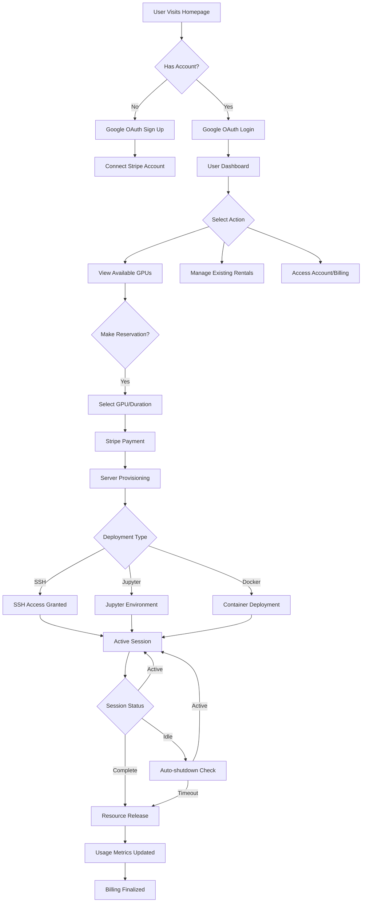
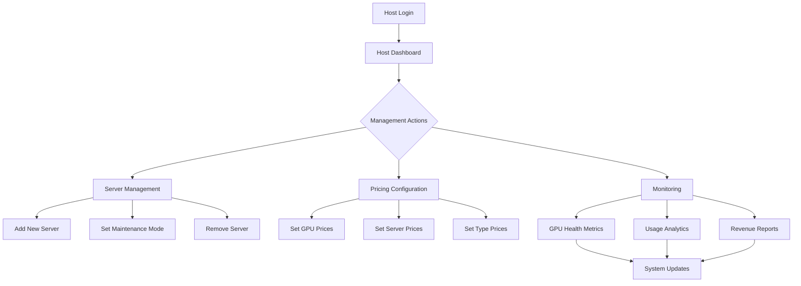
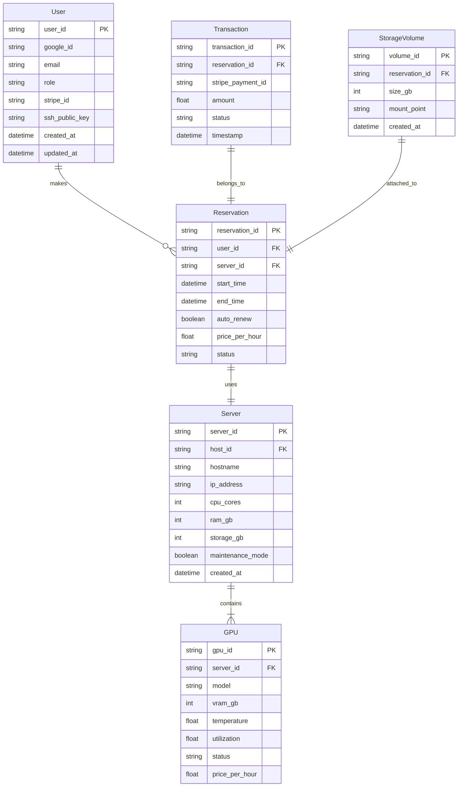
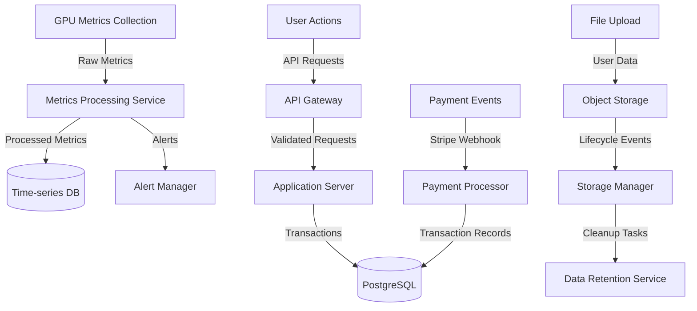

# Product Requirements Document (PRD)

# 1. INTRODUCTION

## 1.1 Purpose
This Software Requirements Specification (SRS) document provides a comprehensive description of the Provocative Cloud GPU rental platform. It details the functional and non-functional requirements for developers, system architects, project managers, and stakeholders involved in the development and implementation of the platform.

## 1.2 Scope
Provocative Cloud is a web-based GPU rental platform that enables users to rent GPU resources for AI/ML workloads while contributing to carbon capture initiatives. The system encompasses:

- GPU Resource Management
  - Real-time inventory tracking of available GPUs
  - Automated server provisioning and deployment
  - GPU health monitoring and metrics collection
  - Resource allocation and scheduling

- User Management
  - OAuth-based authentication through Google
  - Role-based access control (user/host)
  - Stripe payment integration
  - Usage tracking and billing

- Server Infrastructure
  - Ubuntu 20.04-based server deployment
  - Virtual machine provisioning
  - Docker container support
  - Multi-GPU support
  - SSH and Jupyter notebook access

- Storage and Data Management
  - Persistent storage options
  - Data preservation across sessions
  - Automated resource optimization

The platform serves as a bridge between GPU resource owners and users while supporting Provocative's mission of carbon capture through AI infrastructure cooling systems.

# 2. PRODUCT DESCRIPTION

## 2.1 Product Perspective
Provocative Cloud operates as a standalone GPU rental platform while being part of Provocative's larger carbon-capture data center ecosystem. The platform interfaces with:

- Google OAuth for user authentication
- Stripe payment processing system
- Ubuntu 20.04-based server infrastructure
- Docker container registry
- Jupyter notebook services
- SSH protocol for remote access
- GPU monitoring and metrics systems
- Carbon capture cooling infrastructure

## 2.2 Product Functions
- GPU Resource Management
  - Real-time GPU inventory tracking and availability updates
  - Automated server provisioning with Ubuntu 20.04
  - GPU health monitoring and performance metrics collection
  - Resource scheduling and allocation management
  - Multi-GPU support for distributed workloads

- User Management and Access
  - Google OAuth-based user authentication
  - Role-based access control (user/host permissions)
  - SSH key management and access control
  - Jupyter notebook environment provisioning

- Billing and Payment
  - Stripe payment processing integration
  - Usage-based billing (per GPU-hour)
  - Automated credit management
  - Historical transaction tracking

- Server Administration
  - Host-controlled GPU server management
  - Dynamic pricing configuration
  - Server health monitoring
  - Maintenance mode management

## 2.3 User Characteristics
1. AI/ML Developers
   - Technical expertise: Advanced
   - Needs: GPU resources for model training and inference
   - Expected usage: Direct SSH access, custom Docker containers

2. Data Scientists
   - Technical expertise: Intermediate to Advanced
   - Needs: Interactive development environment
   - Expected usage: Jupyter notebooks, pre-built environments

3. Host Administrators
   - Technical expertise: Advanced
   - Needs: System management and monitoring
   - Expected usage: Host dashboard, pricing configuration

## 2.4 Constraints
1. Technical Constraints
   - Limited to Ubuntu 20.04 server environment
   - GPU availability dependent on physical hardware
   - Network bandwidth limitations
   - Storage capacity constraints

2. Business Constraints
   - Maximum rental period of 6 months
   - Minimum rental period of 1 hour
   - Stripe payment processing requirements
   - Google OAuth authentication requirement

3. Operational Constraints
   - Carbon capture system integration requirements
   - Cooling system dependencies
   - Server maintenance windows
   - Resource allocation limits

## 2.5 Assumptions and Dependencies
Assumptions:
- Users have basic Linux/SSH knowledge
- Stable internet connectivity
- Users can make payments via Stripe
- Users have Google accounts for authentication

Dependencies:
- Google OAuth service availability
- Stripe payment processing system
- Ubuntu 20.04 compatibility
- Docker registry accessibility
- GPU driver compatibility
- Carbon capture cooling system functionality
- Network infrastructure reliability
- Storage system availability

# 3. PROCESS FLOWCHART

# 4. FUNCTIONAL REQUIREMENTS

## 4.1 Authentication and User Management

### ID: FR-1
### Description
User authentication and account management system using Google OAuth
### Priority
High
### Requirements

| ID | Requirement | Priority |
|---|---|---|
| FR-1.1 | Support Google OAuth 2.0 sign-in and registration | High |
| FR-1.2 | Create and manage user profiles with roles (user/host) | High |
| FR-1.3 | Store user SSH public keys for server access | High |
| FR-1.4 | Enable Stripe account connection and verification | High |
| FR-1.5 | Implement session management and token-based authentication | Medium |

## 4.2 GPU Resource Management

### ID: FR-2
### Description
Management and monitoring of GPU resources across servers
### Priority
High
### Requirements

| ID | Requirement | Priority |
|---|---|---|
| FR-2.1 | Real-time GPU inventory tracking and status updates | High |
| FR-2.2 | Automated server provisioning with Ubuntu 20.04 | High |
| FR-2.3 | GPU health monitoring (temperature, utilization, memory) | High |
| FR-2.4 | Multi-GPU support and resource allocation | High |
| FR-2.5 | Server maintenance mode management | Medium |

## 4.3 Reservation System

### ID: FR-3
### Description
GPU reservation and scheduling system
### Priority
High
### Requirements

| ID | Requirement | Priority |
|---|---|---|
| FR-3.1 | GPU reservation for 1 hour to 6 months | High |
| FR-3.2 | Automated reservation renewal system | Medium |
| FR-3.3 | Reservation modification and cancellation | Medium |
| FR-3.4 | Waitlist management for unavailable GPUs | Low |
| FR-3.5 | Conflict resolution for overlapping reservations | High |

## 4.4 Billing and Payment

### ID: FR-4
### Description
Payment processing and billing management through Stripe
### Priority
High
### Requirements

| ID | Requirement | Priority |
|---|---|---|
| FR-4.1 | Stripe payment integration for GPU rentals | High |
| FR-4.2 | Usage-based billing calculation (per GPU-hour) | High |
| FR-4.3 | Credit system for prepaid usage | Medium |
| FR-4.4 | Historical transaction tracking and reporting | Medium |
| FR-4.5 | Automated refund processing for cancellations | Medium |

## 4.5 Server Access and Deployment

### ID: FR-5
### Description
Server access methods and deployment options
### Priority
High
### Requirements

| ID | Requirement | Priority |
|---|---|---|
| FR-5.1 | SSH access to rented servers | High |
| FR-5.2 | Docker container deployment support | High |
| FR-5.3 | Jupyter notebook environment provisioning | High |
| FR-5.4 | Persistent storage management | Medium |
| FR-5.5 | Automated idle shutdown system | Medium |

## 4.6 Host Management Interface

### ID: FR-6
### Description
Administrative interface for GPU resource management
### Priority
High
### Requirements

| ID | Requirement | Priority |
|---|---|---|
| FR-6.1 | Server addition and removal capabilities | High |
| FR-6.2 | Dynamic pricing configuration by GPU/server/type | High |
| FR-6.3 | Health metrics monitoring dashboard | High |
| FR-6.4 | Revenue and usage analytics | Medium |
| FR-6.5 | Maintenance scheduling system | Medium |

## 4.7 Monitoring and Reporting

### ID: FR-7
### Description
System-wide monitoring and reporting capabilities
### Priority
Medium
### Requirements

| ID | Requirement | Priority |
|---|---|---|
| FR-7.1 | Real-time GPU health metrics collection | High |
| FR-7.2 | Usage statistics and analytics | Medium |
| FR-7.3 | System performance monitoring | Medium |
| FR-7.4 | Automated alert system for issues | Medium |
| FR-7.5 | Custom report generation | Low |

## 4.8 Storage Management

### ID: FR-8
### Description
Data storage and persistence management
### Priority
Medium
### Requirements

| ID | Requirement | Priority |
|---|---|---|
| FR-8.1 | Persistent storage allocation | High |
| FR-8.2 | Data backup and recovery | Medium |
| FR-8.3 | Storage quota management | Medium |
| FR-8.4 | Cross-session data preservation | Medium |
| FR-8.5 | Storage cleanup after reservation end | Medium |

# 5. NON-FUNCTIONAL REQUIREMENTS

## 5.1 Performance Requirements

| ID | Requirement | Target Metric |
|---|---|---|
| NFR-1.1 | Server provisioning time | < 5 minutes |
| NFR-1.2 | Dashboard response time | < 2 seconds |
| NFR-1.3 | GPU metrics update frequency | Every 30 seconds |
| NFR-1.4 | Payment processing time | < 3 seconds |
| NFR-1.5 | Maximum concurrent users per server | 1 user per GPU |
| NFR-1.6 | Storage I/O performance | Minimum 500MB/s read/write |
| NFR-1.7 | Network bandwidth | Minimum 1Gbps per server |

## 5.2 Safety Requirements

| ID | Requirement | Description |
|---|---|---|
| NFR-2.1 | Automatic GPU shutdown | Temperature exceeding 85°C |
| NFR-2.2 | Data preservation | Automated backup every 6 hours |
| NFR-2.3 | Failover mechanisms | Redundant system components |
| NFR-2.4 | Emergency shutdown | Critical system failure protocols |
| NFR-2.5 | Resource isolation | Complete separation between user environments |

## 5.3 Security Requirements

| ID | Requirement | Description |
|---|---|---|
| NFR-3.1 | Authentication | OAuth 2.0 with Google, MFA support |
| NFR-3.2 | Data encryption | AES-256 for data at rest, TLS 1.3 for data in transit |
| NFR-3.3 | Access control | Role-based access control (RBAC) |
| NFR-3.4 | Network security | Firewall, intrusion detection, DDoS protection |
| NFR-3.5 | Compliance logging | Audit trails for all system access |
| NFR-3.6 | Key management | Secure SSH key storage and rotation |
| NFR-3.7 | Payment security | PCI DSS compliant payment processing |

## 5.4 Quality Requirements

### 5.4.1 Availability
- System uptime: 99.9% excluding planned maintenance
- Maximum planned downtime: 4 hours per month
- Unplanned downtime recovery: < 1 hour

### 5.4.2 Maintainability
- Modular architecture for easy updates
- Automated deployment processes
- Comprehensive system documentation
- Regular security patches and updates

### 5.4.3 Usability
- Mobile-responsive web interface
- Maximum 3 clicks to major functions
- Clear error messages and recovery paths
- Comprehensive help documentation
- Intuitive dashboard layout

### 5.4.4 Scalability
- Support for 1000+ concurrent users
- Elastic resource allocation
- Horizontal scaling capability
- Load balancing across multiple servers
- Dynamic resource provisioning

### 5.4.5 Reliability
- Mean Time Between Failures (MTBF): > 720 hours
- Mean Time To Recovery (MTTR): < 1 hour
- Data durability: 99.999%
- Automated system health checks
- Regular backup verification

## 5.5 Compliance Requirements

| ID | Requirement | Description |
|---|---|---|
| NFR-5.1 | GDPR compliance | EU data protection requirements |
| NFR-5.2 | CCPA compliance | California privacy requirements |
| NFR-5.3 | PCI DSS | Payment card industry standards |
| NFR-5.4 | ISO 27001 | Information security management |
| NFR-5.5 | SOC 2 Type II | Security and availability controls |
| NFR-5.6 | Environmental | Carbon capture reporting standards |
| NFR-5.7 | Data residency | Regional data storage compliance |

# 6. DATA REQUIREMENTS

## 6.1 Data Models

## 6.2 Data Storage

### 6.2.1 Primary Storage
- PostgreSQL database cluster for transactional data
- Minimum 99.999% durability requirement
- Multi-AZ deployment with automatic failover
- Point-in-time recovery (PITR) with 35-day retention
- Automated backups every 6 hours

### 6.2.2 User Data Storage
- Object storage system for user data persistence
- Data encryption at rest using AES-256
- Lifecycle policies for automated cleanup
- Cross-region replication for disaster recovery
- Retention period: 30 days after reservation end

### 6.2.3 Metrics Storage
- Time-series database for GPU metrics
- 30-day retention for detailed metrics
- 1-year retention for aggregated metrics
- 5-minute resolution for active metrics
- 1-hour resolution for historical data

### 6.2.4 Backup Strategy
- Daily incremental backups
- Weekly full backups
- 30-day retention for daily backups
- 90-day retention for weekly backups
- Offsite backup storage with encryption

## 6.3 Data Processing

### 6.3.1 Data Security
- End-to-end encryption for all data transfers
- Role-based access control for all data operations
- Data masking for sensitive information
- Regular security audits and penetration testing
- Compliance with GDPR and CCPA requirements

### 6.3.2 Data Processing Requirements
- Real-time GPU metrics processing
- Asynchronous transaction processing
- Batch processing for analytics
- Stream processing for monitoring
- Event-driven architecture for scalability

### 6.3.3 Data Validation
- Schema validation for all incoming data
- Input sanitization for user data
- Data integrity checks
- Automated data quality monitoring
- Error logging and reporting

### 6.3.4 Data Integration
- REST API for external integrations
- Webhook support for event notifications
- Batch import/export capabilities
- Real-time data synchronization
- ETL pipelines for analytics

# 7. EXTERNAL INTERFACES

## 7.1 User Interfaces

### 7.1.1 Web Application Interface

| Component | Requirements |
|-----------|--------------|
| Login Page | - Google OAuth sign-in button - Stripe connection option - Company/product information - Responsive design for mobile/desktop |
| User Dashboard | - Available GPU listing with filterable specs - Current rentals status - Usage metrics and graphs - Billing history and credits - Reservation management controls |
| Host Dashboard | - GPU server management interface - Pricing configuration panel - Health monitoring displays - Analytics and reporting views - Maintenance controls |
| Jupyter Interface | - Web-based notebook environment - Code editor - Output display - File browser - Terminal access |

### 7.1.2 Command Line Interface

| Interface | Requirements |
|-----------|--------------|
| SSH Access | - Standard SSH protocol support - Key-based authentication - Terminal emulation - File transfer capabilities |
| Docker CLI | - Container management commands - Image building support - Volume mounting - Network configuration |

## 7.2 Hardware Interfaces

### 7.2.1 GPU Hardware

| Component | Interface Requirements |
|-----------|----------------------|
| NVIDIA GPUs | - CUDA driver interface - PCIe bus communication - Memory management interface - Temperature sensor access |
| Storage Devices | - NVMe/SSD interface - Block device access - RAID controller interface |
| Network Hardware | - 10GbE network interface - TCP/IP stack integration - Network card monitoring |

### 7.2.2 Carbon Capture Hardware

| Component | Interface Requirements |
|-----------|----------------------|
| Cooling System | - Temperature sensor interface - Airflow control interface - CO2 measurement interface |
| Environmental Sensors | - CO2 concentration monitoring - Temperature monitoring - Humidity monitoring |

## 7.3 Software Interfaces

| System | Interface Requirements |
|--------|----------------------|
| Ubuntu 20.04 | - System calls and kernel interface - Package management system - Service management interface |
| Docker Engine | - Container runtime API - Volume management interface - Network interface |
| NVIDIA Driver | - CUDA runtime API - GPU management interface - Monitoring interface |
| PostgreSQL | - Database connection interface - Query interface - Transaction management |
| Object Storage | - S3-compatible API - Authentication interface - Bucket management |

## 7.4 Communication Interfaces

### 7.4.1 External Services

| Service | Protocol/Format |
|---------|----------------|
| Google OAuth | - OAuth 2.0 protocol - HTTPS/TLS 1.3 - JSON data format |
| Stripe API | - REST API - HTTPS/TLS 1.3 - Webhook events - JSON data format |

### 7.4.2 Internal Communications

| Component | Protocol/Format |
|-----------|----------------|
| API Gateway | - REST API - GraphQL - WebSocket - JSON data format |
| Metrics Collection | - MQTT protocol - Prometheus format - gRPC streams |
| Storage Access | - S3 protocol - NFS v4 - iSCSI |
| Container Networking | - Docker network protocol - DNS resolution - TCP/UDP ports |

### 7.4.3 Security Protocols

| Protocol | Requirements |
|----------|--------------|
| TLS | - Version 1.3 minimum - Strong cipher suites - Certificate management |
| SSH | - OpenSSH protocol - Key-based authentication - Secure key exchange |
| API Security | - JWT tokens - CORS policies - Rate limiting |

# 8. APPENDICES

## 8.1 GLOSSARY

| Term | Definition |
|------|------------|
| Carbon Capture | The process of capturing and storing atmospheric carbon dioxide to reduce greenhouse gas emissions |
| Container | A standard unit of software that packages code and all its dependencies |
| GPU | Graphics Processing Unit - specialized processors designed to accelerate graphics and machine learning workloads |
| Host | Administrator of GPU servers on the Provocative Cloud platform |
| Idle Shutdown | Automatic deactivation of GPU resources when not in use |
| Inference | The process of using a trained machine learning model to make predictions |
| Persistent Storage | Data storage that maintains state between sessions |
| Virtual Machine | An emulation of a computer system providing functionality of a physical computer |

## 8.2 ACRONYMS

| Acronym | Expansion |
|---------|-----------|
| AI | Artificial Intelligence |
| API | Application Programming Interface |
| CCPA | California Consumer Privacy Act |
| CLI | Command Line Interface |
| CO2 | Carbon Dioxide |
| CORS | Cross-Origin Resource Sharing |
| CPU | Central Processing Unit |
| CUDA | Compute Unified Device Architecture |
| DDoS | Distributed Denial of Service |
| ETL | Extract, Transform, Load |
| GDPR | General Data Protection Regulation |
| GPU | Graphics Processing Unit |
| JWT | JSON Web Token |
| ML | Machine Learning |
| MQTT | Message Queuing Telemetry Transport |
| MFA | Multi-Factor Authentication |
| NFS | Network File System |
| OAuth | Open Authorization |
| PCI DSS | Payment Card Industry Data Security Standard |
| PITR | Point-in-Time Recovery |
| RAID | Redundant Array of Independent Disks |
| RBAC | Role-Based Access Control |
| REST | Representational State Transfer |
| SOC | Service Organization Control |
| SSH | Secure Shell |
| TLS | Transport Layer Security |
| VM | Virtual Machine |

## 8.3 ADDITIONAL REFERENCES

| Reference | Description |
|-----------|------------|
| [NVIDIA CUDA Documentation](https://docs.nvidia.com/cuda/) | Technical documentation for CUDA programming |
| [Docker Documentation](https://docs.docker.com/) | Official Docker platform documentation |
| [Ubuntu Server Guide](https://ubuntu.com/server/docs) | Ubuntu 20.04 server documentation |
| [Stripe API Reference](https://stripe.com/docs/api) | Payment integration documentation |
| [Google OAuth 2.0](https://developers.google.com/identity/protocols/oauth2) | Authentication implementation guide |
| [Jupyter Documentation](https://jupyter.org/documentation) | Jupyter notebook environment setup and usage |
| [PostgreSQL Documentation](https://www.postgresql.org/docs/) | Database management system documentation |