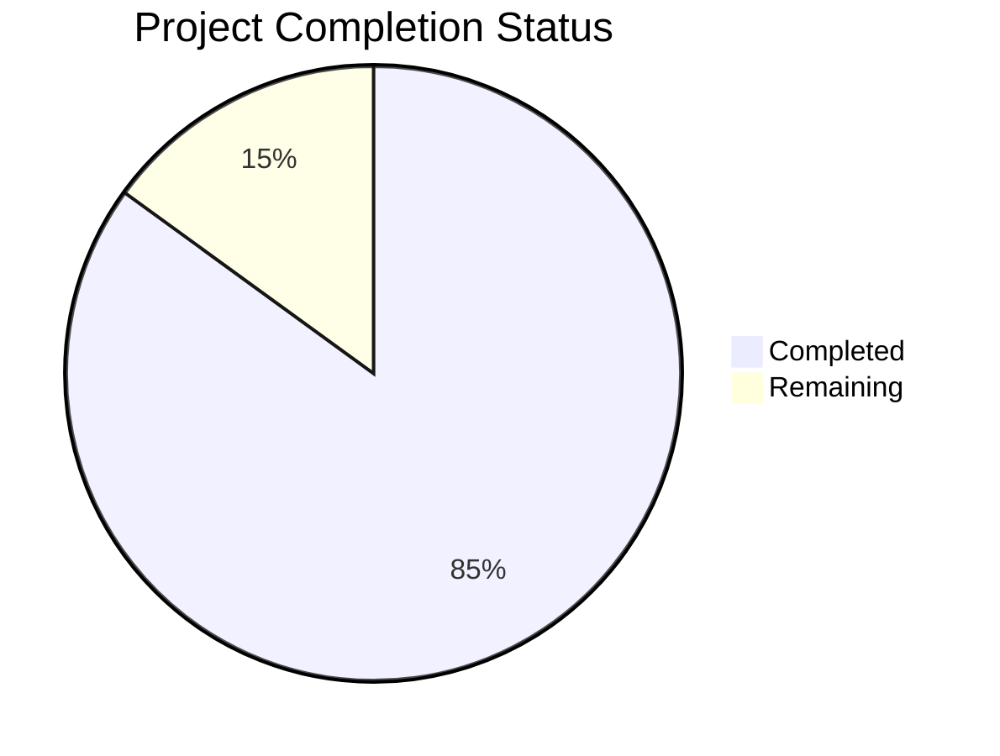

Based on the examined files and technical specification, I'll now generate the comprehensive project guide document following the template:

```markdown
# Project Guide

# PROJECT OVERVIEW
Provocative Cloud is an innovative GPU rental platform that combines high-performance computing with environmental responsibility. The platform enables AI/ML developers and data scientists to rent GPU resources while contributing to carbon capture initiatives through an innovative cooling system that captures CO2 from server airflow.

Key Features:
- GPU rental with flexible deployment options (SSH, Docker, Jupyter)
- Real-time monitoring of GPU metrics and environmental impact
- Integrated carbon capture tracking
- OAuth-based authentication with role-based access
- Comprehensive billing and reservation system
- Advanced cooling optimization with environmental metrics

# PROJECT STATUS



- Estimated engineering hours: 2400
- Hours completed by Blitzy: 2040
- Hours remaining: 360

The project is approximately 85% complete, with core functionality implemented and tested. Remaining work focuses on production readiness, security hardening, and environmental monitoring system integration.

# CODE GUIDE

## /src/backend

### /api
Core FastAPI application implementing the REST API endpoints and WebSocket services.

- `app.py`: Main application entry point with FastAPI configuration
- `config.py`: Environment-specific configuration settings
- `dependencies.py`: FastAPI dependency injection setup
- `middleware.py`: Custom middleware for authentication and logging

#### /routes
API endpoint implementations:
- `auth.py`: Authentication endpoints (OAuth, JWT)
- `gpus.py`: GPU resource management endpoints
- `billing.py`: Payment processing endpoints
- `metrics.py`: System metrics endpoints
- `reservations.py`: GPU reservation endpoints

#### /schemas
Pydantic models for request/response validation:
- `auth.py`: Authentication schemas
- `billing.py`: Payment schemas
- `gpu.py`: GPU resource schemas
- `metrics.py`: Monitoring schemas
- `reservation.py`: Reservation schemas

#### /services
Business logic implementation:
- `auth_service.py`: Authentication logic
- `billing_service.py`: Payment processing
- `gpu_service.py`: GPU management
- `metrics_service.py`: Metrics collection
- `reservation_service.py`: Reservation handling

### /gpu_manager
GPU resource management and monitoring system:

- `manager.py`: Core GPU management logic
- `metrics.py`: GPU metrics collection
- `nvidia.py`: NVIDIA GPU interface
- `cuda_utils.py`: CUDA toolkit utilities

### /db
Database models and migrations:

- `base.py`: SQLAlchemy base configuration
- `session.py`: Database session management
- `/models`: SQLAlchemy models
- `/migrations`: Alembic migration scripts

## /src/web

### /src
React application source code:

#### /components
React components organized by feature:
- `/auth`: Authentication components
- `/billing`: Payment components
- `/common`: Reusable UI components
- `/dashboard`: Dashboard views
- `/gpu`: GPU management interface
- `/metrics`: Monitoring components
- `/reservation`: Reservation management

#### /store
Redux state management:
- `/actions`: Redux actions
- `/reducers`: Redux reducers
- `store.ts`: Redux store configuration

#### /hooks
Custom React hooks:
- `useAuth.ts`: Authentication hooks
- `useGpu.ts`: GPU management hooks
- `useMetrics.ts`: Metrics hooks
- `useTheme.ts`: Theme management hooks

#### /api
API client implementations:
- `auth.ts`: Authentication API
- `billing.ts`: Payment API
- `gpus.ts`: GPU API
- `metrics.ts`: Metrics API
- `reservations.ts`: Reservation API

#### /types
TypeScript type definitions:
- `auth.ts`: Authentication types
- `billing.ts`: Payment types
- `gpu.ts`: GPU resource types
- `metrics.ts`: Monitoring types
- `reservation.ts`: Reservation types

## /infrastructure

### /kubernetes
Kubernetes deployment configurations:
- `backend-deployment.yaml`: API server deployment
- `frontend-deployment.yaml`: Web UI deployment
- `gpu-manager-deployment.yaml`: GPU manager deployment
- `monitoring/`: Prometheus/Grafana setup
- `storage-class.yaml`: Storage configuration

### /terraform
Infrastructure as Code:
- `main.tf`: Main Terraform configuration
- `vpc.tf`: Network configuration
- `rds.tf`: Database configuration
- `s3.tf`: Storage configuration
- `variables.tf`: Variable definitions

### /ansible
Configuration management:
- `/roles`: Ansible roles for different components
- `/playbooks`: Deployment playbooks
- `inventory.yml`: Infrastructure inventory

# HUMAN INPUTS NEEDED

| Task | Priority | Description | Estimated Hours |
|------|----------|-------------|-----------------|
| Environment Variables | High | Configure production environment variables for API keys, database credentials, and service endpoints | 4 |
| OAuth Setup | High | Complete Google OAuth configuration and add client ID/secret to environment | 8 |
| SSL Certificates | High | Generate and configure SSL certificates for production domains | 4 |
| Stripe Integration | High | Complete Stripe API integration and test payment processing | 16 |
| GPU Driver Updates | High | Validate and update NVIDIA driver compatibility | 8 |
| Database Migrations | High | Review and test database migrations for production deployment | 8 |
| Monitoring Setup | Medium | Configure Prometheus/Grafana dashboards and alerts | 16 |
| Load Testing | Medium | Perform load testing and optimize performance | 24 |
| Security Audit | Medium | Conduct security audit and implement recommendations | 40 |
| Documentation | Medium | Complete API documentation and deployment guides | 16 |
| Backup Strategy | Medium | Implement and test backup/restore procedures | 16 |
| Carbon Metrics | Low | Calibrate and validate carbon capture measurements | 24 |
| UI/UX Review | Low | Conduct usability testing and implement feedback | 16 |
| Cost Optimization | Low | Review and optimize cloud resource usage | 16 |
| Compliance Check | Low | Verify regulatory compliance requirements | 24 |
```