# Technical Specifications

# 1. INTRODUCTION

## 1.1 EXECUTIVE SUMMARY

Provocative Cloud is a GPU rental platform designed to provide on-demand access to GPU computing resources while contributing to carbon capture initiatives. The platform enables AI/ML developers and data scientists to rent GPU resources by the hour while leveraging Provocative's innovative cooling system that captures CO2 from server airflow. This solution addresses the growing demand for accessible GPU computing while simultaneously tackling environmental concerns in the AI infrastructure space.

The platform serves three primary stakeholder groups: end users requiring GPU resources, system administrators managing the GPU infrastructure, and Provocative's business operations team. By providing a seamless rental experience with integrated billing, monitoring, and deployment capabilities, Provocative Cloud aims to capture market share in the growing GPU-as-a-service sector while maintaining a strong environmental focus.

## 1.2 SYSTEM OVERVIEW

### Project Context

| Aspect | Description |
|--------|------------|
| Market Position | Premium GPU rental service with environmental benefits |
| Target Market | AI/ML developers, researchers, data scientists |
| Competitive Advantage | Integrated carbon capture, flexible rental periods, comprehensive monitoring |
| Enterprise Integration | Standalone platform with standard OAuth/payment integrations |

### High-Level Description

| Component | Description |
|-----------|------------|
| User Platform | Web-based dashboard for GPU rental and management |
| Host Platform | Administrative interface for resource management |
| Server Infrastructure | Ubuntu 20.04-based GPU servers with monitoring |
| Integration Layer | OAuth, Stripe, monitoring, and deployment services |

### Success Criteria

| Metric | Target |
|--------|--------|
| Platform Uptime | 99.9% |
| GPU Utilization | >80% |
| User Satisfaction | >90% positive feedback |
| Carbon Capture | >50% offset of operational emissions |
| Market Penetration | 15% market share within 12 months |

## 1.3 SCOPE

### In-Scope Elements

#### Core Features

| Category | Features |
|----------|----------|
| User Management | - Google OAuth authentication<br>- Role-based access control<br>- Stripe payment integration |
| Resource Management | - GPU inventory tracking<br>- Health monitoring<br>- Usage metrics<br>- Automated provisioning |
| Deployment Options | - SSH access<br>- Docker containers<br>- Jupyter notebooks<br>- Persistent storage |
| Administration | - Server management<br>- Dynamic pricing<br>- Maintenance controls |

#### Implementation Boundaries

| Boundary | Coverage |
|----------|----------|
| User Types | - AI/ML developers<br>- Data scientists<br>- System administrators |
| Geographic Coverage | - Global deployment<br>- Region-specific data centers |
| Technical Scope | - GPU resource management<br>- Virtual machine provisioning<br>- Container orchestration<br>- Usage monitoring |
| Data Management | - User data<br>- System metrics<br>- Billing information<br>- Performance analytics |

### Out-of-Scope Elements

| Category | Excluded Elements |
|----------|------------------|
| Features | - Custom hardware configurations<br>- Bare metal server access<br>- Long-term dedicated hosting<br>- Custom cooling solutions |
| Support | - 24/7 live support<br>- Hardware maintenance services<br>- Custom software development<br>- Training services |
| Integration | - Private cloud deployment<br>- Custom authentication systems<br>- Alternative payment methods<br>- Third-party monitoring tools |
| Infrastructure | - Non-GPU computing resources<br>- Network infrastructure management<br>- Physical security systems<br>- Facility management |

# 2. SYSTEM ARCHITECTURE

## 2.1 High-Level Architecture

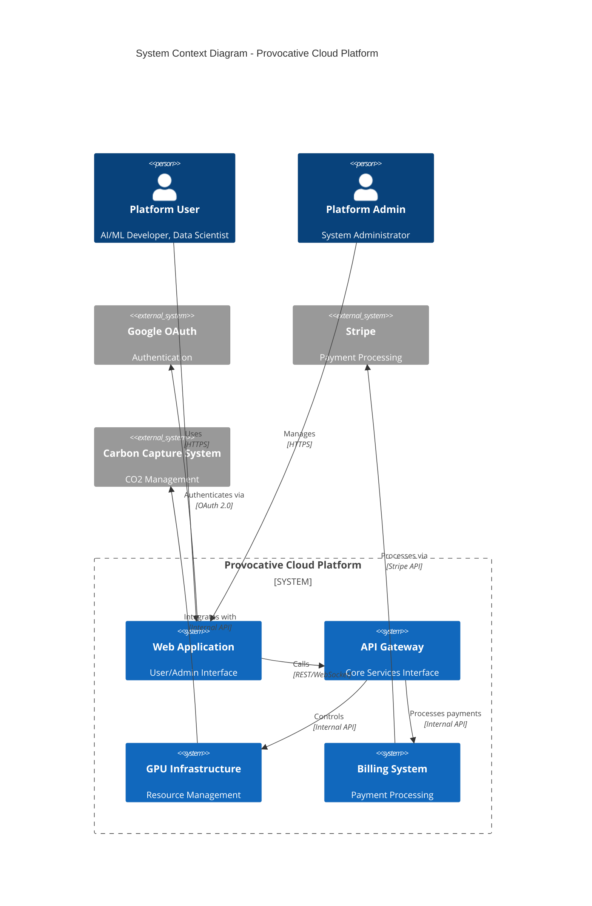

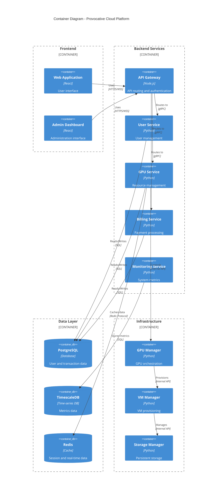

## 2.2 Component Details

### 2.2.1 Frontend Components

| Component | Details |
|-----------|---------|
| Web Application | - Framework: React with TypeScript<br>- State Management: Redux<br>- UI Components: Material-UI<br>- Real-time Updates: WebSocket<br>- Authentication: JWT tokens |
| Admin Dashboard | - Framework: React with TypeScript<br>- Analytics: Chart.js<br>- Monitoring: Real-time metrics<br>- Access Control: RBAC implementation |

### 2.2.2 Backend Services

| Service | Details |
|---------|---------|
| API Gateway | - Runtime: Node.js<br>- Protocol: REST/GraphQL/WebSocket<br>- Authentication: JWT/OAuth<br>- Rate Limiting: Redis-based<br>- Load Balancing: nginx |
| User Service | - Runtime: Python/FastAPI<br>- Database: PostgreSQL<br>- Caching: Redis<br>- Authentication: Google OAuth integration |
| GPU Service | - Runtime: Python/FastAPI<br>- Orchestration: Custom GPU manager<br>- Monitoring: Prometheus/Grafana<br>- Metrics: TimescaleDB |
| Billing Service | - Runtime: Python/FastAPI<br>- Payment: Stripe integration<br>- Transactions: PostgreSQL<br>- Queue: RabbitMQ |

### 2.2.3 Infrastructure Components

| Component | Details |
|-----------|---------|
| GPU Manager | - Runtime: Python<br>- Driver: NVIDIA CUDA<br>- Monitoring: GPU metrics collection<br>- Orchestration: Resource allocation |
| VM Manager | - Runtime: Python<br>- Virtualization: KVM<br>- Networking: OpenVSwitch<br>- Storage: Ceph integration |
| Storage Manager | - Runtime: Python<br>- Backend: Ceph<br>- Protocol: S3-compatible<br>- Persistence: Block/Object storage |

## 2.3 Technical Decisions

### 2.3.1 Architecture Style

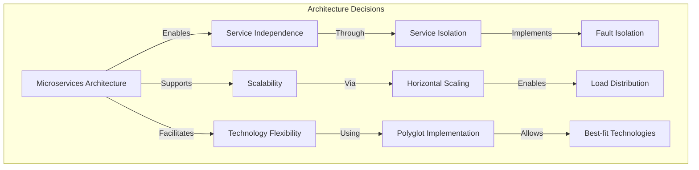

### 2.3.2 Communication Patterns

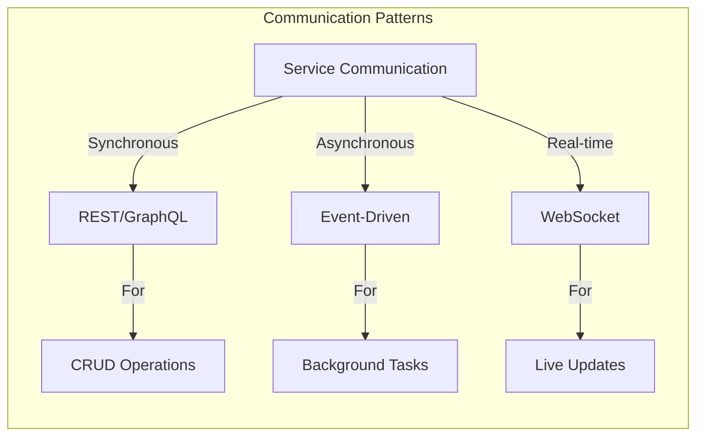

## 2.4 Cross-Cutting Concerns

### 2.4.1 Monitoring and Observability

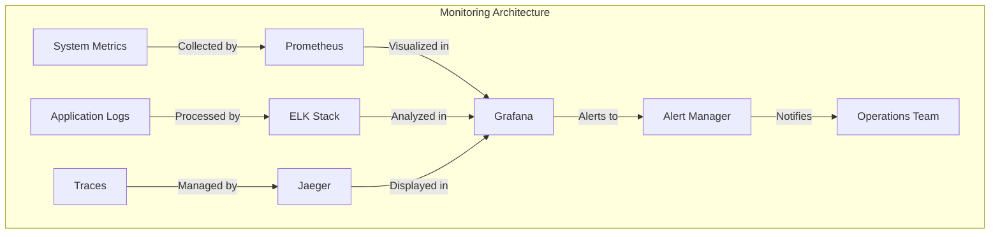

### 2.4.2 Deployment Architecture

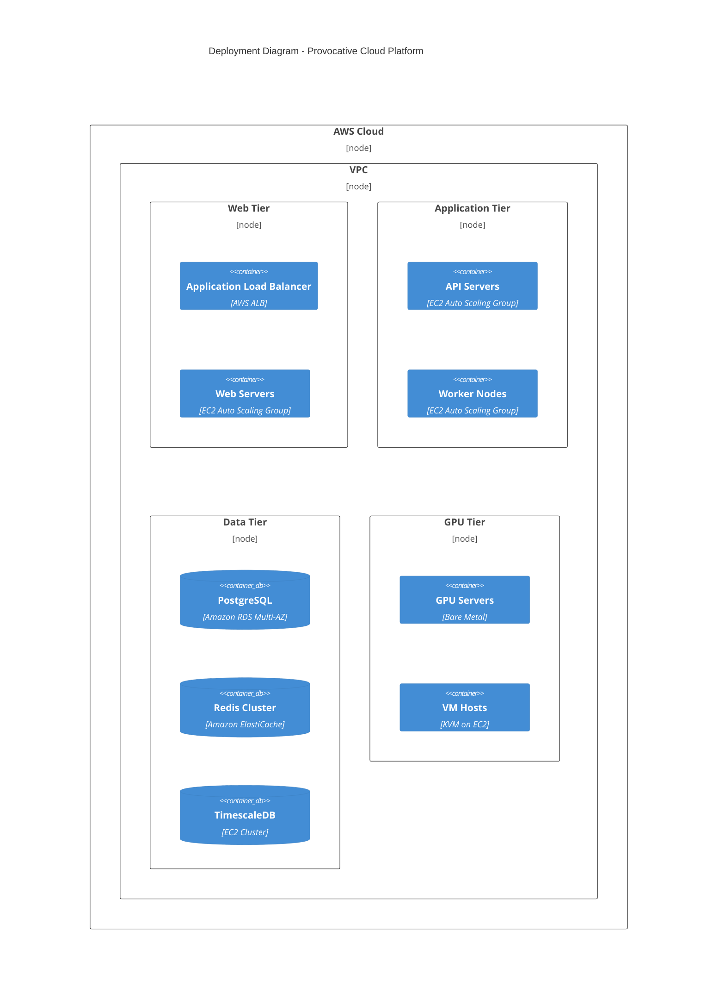

# 3. SYSTEM COMPONENTS ARCHITECTURE

## 3.1 USER INTERFACE DESIGN

### 3.1.1 Design Specifications

| Category | Requirements |
|----------|--------------|
| Visual Hierarchy | - F-pattern layout for dashboards<br>- Z-pattern layout for landing pages<br>- Card-based GPU listings<br>- Metric-focused monitoring views |
| Component Library | - Material-UI v5<br>- Custom themed components<br>- Consistent spacing system<br>- Typography scale: 1.2 ratio |
| Responsive Design | - Breakpoints: 320px, 768px, 1024px, 1440px<br>- Mobile-first approach<br>- Fluid typography<br>- Flexible grid system |
| Accessibility | - WCAG 2.1 Level AA compliance<br>- ARIA labels<br>- Keyboard navigation<br>- Screen reader support |
| Browser Support | - Chrome 90+<br>- Firefox 88+<br>- Safari 14+<br>- Edge 90+<br>- Mobile browsers: iOS 14+, Android 8+ |
| Theming | - Light/dark mode toggle<br>- System preference detection<br>- Persistent theme selection<br>- High contrast option |

### 3.1.2 Interface Elements

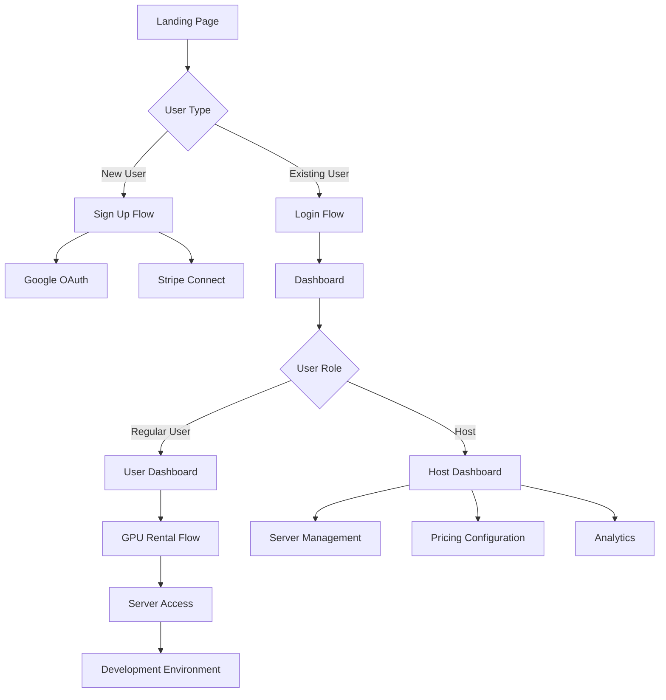

### 3.1.3 CLI Interface

| Component | Specification |
|-----------|--------------|
| Command Structure | `provocative-cli <command> [options] <arguments>` |
| Base Commands | - `login`: Authenticate user<br>- `list`: Show available GPUs<br>- `rent`: Reserve GPU<br>- `status`: Check rental status<br>- `deploy`: Deploy container<br>- `ssh`: Connect to server |
| Options Format | - Short form: `-h`<br>- Long form: `--help`<br>- With values: `--duration=24h` |
| Output Formats | - JSON (default)<br>- Table format<br>- YAML<br>- Plain text |
| Error Handling | - Error codes<br>- Descriptive messages<br>- Debug mode output |

## 3.2 DATABASE DESIGN

### 3.2.1 Schema Design

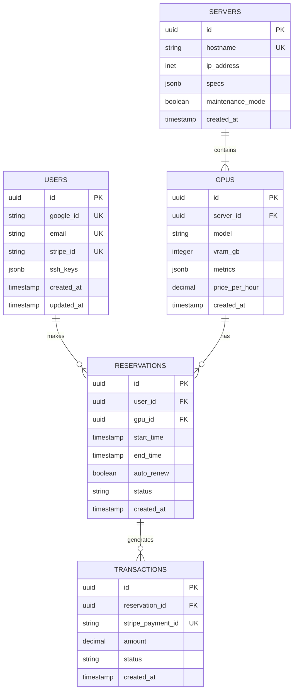

### 3.2.2 Data Management

| Aspect | Implementation |
|--------|----------------|
| Partitioning | - Time-based partitioning for metrics<br>- Range partitioning for transactions<br>- List partitioning for servers by region |
| Indexing | - B-tree indexes for primary keys<br>- GiST indexes for IP addresses<br>- Partial indexes for active reservations |
| Archival | - 30-day retention for metrics<br>- 7-year retention for transactions<br>- Yearly archival to cold storage |
| Backup | - Hourly WAL archiving<br>- Daily full backups<br>- Weekly incremental backups<br>- 30-day retention |

### 3.2.3 Performance Optimization

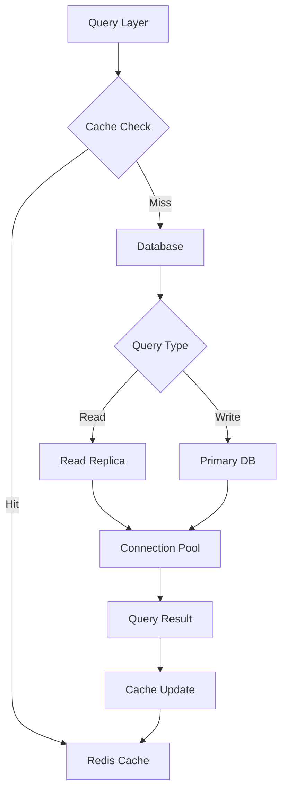

## 3.3 API DESIGN

### 3.3.1 API Architecture

| Component | Specification |
|-----------|--------------|
| Protocol | - REST over HTTPS<br>- WebSocket for real-time updates |
| Authentication | - JWT tokens<br>- OAuth 2.0 flow<br>- API keys for service accounts |
| Rate Limiting | - 1000 requests/hour per user<br>- 5000 requests/hour for hosts<br>- 100 requests/minute burst |
| Versioning | - URI versioning: `/v1/`<br>- Semantic versioning<br>- Deprecation notices |

### 3.3.2 API Endpoints

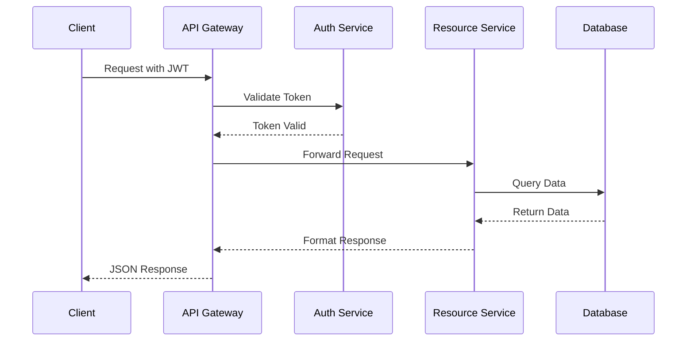

### 3.3.3 Integration Specifications

| Service | Integration Method |
|---------|-------------------|
| Google OAuth | - OAuth 2.0 protocol<br>- Scoped permissions<br>- Refresh token handling |
| Stripe | - Webhook events<br>- Idempotency keys<br>- Automatic retries |
| GPU Metrics | - Pull-based collection<br>- Push notifications<br>- Aggregation pipeline |
| Storage | - S3-compatible API<br>- Presigned URLs<br>- Multipart uploads |

# 4. TECHNOLOGY STACK

## 4.1 PROGRAMMING LANGUAGES

| Platform/Component | Language & Version | Justification |
|-------------------|-------------------|----------------|
| Frontend | TypeScript 5.0+ | - Strong typing for complex GPU management interfaces<br>- Enhanced developer productivity<br>- Better maintainability for large codebase |
| Backend Services | Python 3.10+ | - Extensive ML/GPU libraries support<br>- Strong async capabilities for real-time monitoring<br>- Robust system integration tools |
| GPU Management | Python 3.10+ | - Native CUDA toolkit integration<br>- Efficient system-level operations<br>- Rich scientific computing libraries |
| Infrastructure Scripts | Go 1.20+ | - Efficient system-level programming<br>- Strong concurrency support<br>- Native cloud platform integrations |

## 4.2 FRAMEWORKS & LIBRARIES

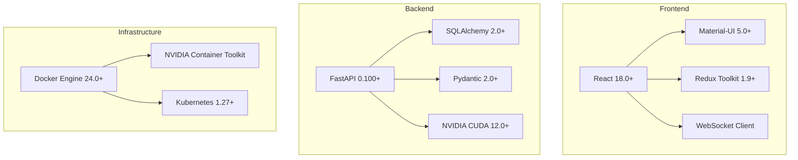

### Core Frameworks

| Layer | Framework | Version | Justification |
|-------|-----------|---------|---------------|
| Frontend Web | React | 18.0+ | - Robust component ecosystem<br>- Server-side rendering support<br>- Strong TypeScript integration |
| API Server | FastAPI | 0.100+ | - High performance async capabilities<br>- Native OpenAPI support<br>- WebSocket integration |
| ORM | SQLAlchemy | 2.0+ | - Mature database abstraction<br>- Strong typing support<br>- Complex query optimization |
| GPU Management | CUDA Toolkit | 12.0+ | - Direct GPU access<br>- Comprehensive monitoring<br>- Performance optimization |

## 4.3 DATABASES & STORAGE

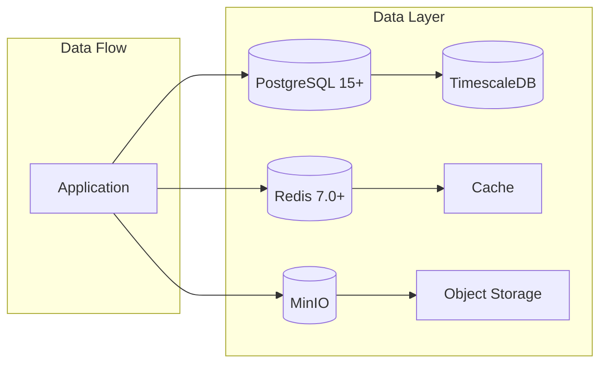

| Type | Technology | Purpose | Justification |
|------|------------|---------|---------------|
| Primary Database | PostgreSQL 15+ | Transactional data | - ACID compliance<br>- Complex query support<br>- Robust replication |
| Time-series Data | TimescaleDB | Metrics storage | - Optimized for time-series<br>- PostgreSQL compatibility<br>- Efficient data retention |
| Caching | Redis 7.0+ | Session & real-time data | - High performance<br>- Pub/sub support<br>- Cluster support |
| Object Storage | MinIO | User data & artifacts | - S3 compatibility<br>- High throughput<br>- Scalable architecture |

## 4.4 THIRD-PARTY SERVICES

| Service | Provider | Purpose | Integration Method |
|---------|----------|---------|-------------------|
| Authentication | Google OAuth 2.0 | User authentication | OAuth 2.0 protocol |
| Payment Processing | Stripe | Billing & payments | REST API & Webhooks |
| Monitoring | Prometheus/Grafana | System metrics | Metrics API |
| Cloud Infrastructure | AWS | Infrastructure hosting | AWS SDK |
| Email Service | AWS SES | Transactional emails | SMTP/API |
| CDN | Cloudflare | Content delivery | DNS/API |

## 4.5 DEVELOPMENT & DEPLOYMENT

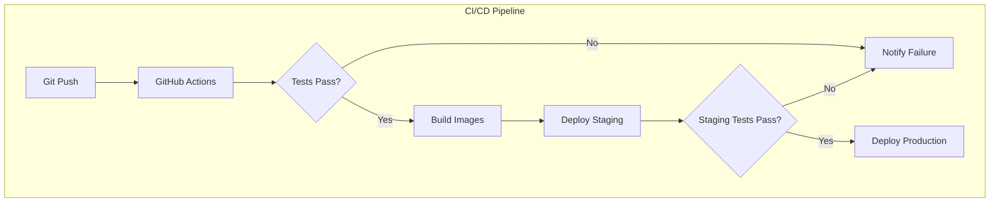

### Development Tools

| Category | Tool | Version | Purpose |
|----------|------|---------|----------|
| IDE | VSCode | Latest | Primary development environment |
| API Testing | Postman | Latest | API development & testing |
| Version Control | Git | 2.40+ | Source code management |
| Container Runtime | Docker | 24.0+ | Development containers |

### Build & Deployment

| Component | Technology | Version | Purpose |
|-----------|------------|---------|----------|
| CI/CD | GitHub Actions | Latest | Automated pipeline |
| Container Registry | AWS ECR | Latest | Image storage |
| Infrastructure as Code | Terraform | 1.5+ | Infrastructure management |
| Orchestration | Kubernetes | 1.27+ | Container orchestration |
| Monitoring | Prometheus | 2.44+ | Metrics collection |
| Logging | ELK Stack | 8.0+ | Log aggregation |

# 5. SYSTEM DESIGN

## 5.1 USER INTERFACE DESIGN

### 5.1.1 Web Application Layout

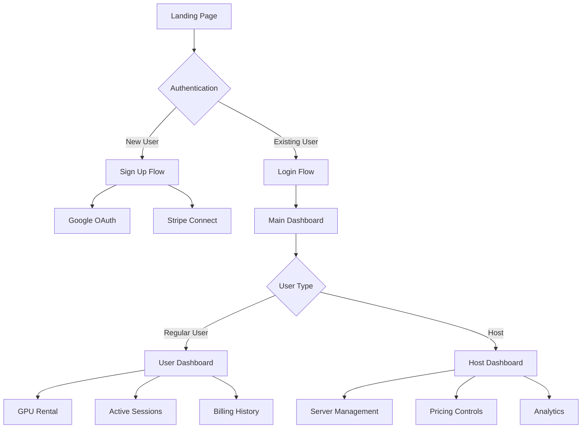

### 5.1.2 Component Specifications

| Component | Layout | Key Elements |
|-----------|---------|-------------|
| Landing Page | Hero Section | - Value proposition<br>- GPU availability<br>- Pricing overview<br>- Sign up/login buttons |
| User Dashboard | 3-Column Grid | - Available GPUs list<br>- Active rentals<br>- Usage metrics<br>- Quick actions |
| Host Dashboard | 2-Column Grid | - Server status overview<br>- Revenue metrics<br>- Health indicators<br>- Management controls |
| GPU Details | Modal/Page | - Technical specifications<br>- Pricing information<br>- Availability calendar<br>- Rental controls |

### 5.1.3 Command Line Interface

```bash
provocative-cli <command> [options]

Commands:
  login         Authenticate with Google OAuth
  list          Show available GPUs
  rent          Reserve GPU resources
  status        Check rental status
  deploy        Deploy container or environment
  ssh           Connect to rented server
  monitor       View GPU metrics
```

## 5.2 DATABASE DESIGN

### 5.2.1 Schema Design

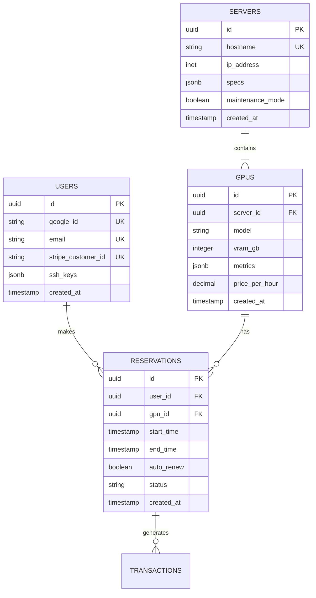

### 5.2.2 Data Storage Strategy

| Data Type | Storage Solution | Justification |
|-----------|-----------------|---------------|
| User Data | PostgreSQL | ACID compliance, complex queries |
| GPU Metrics | TimescaleDB | Time-series optimization |
| Session Data | Redis | High-performance caching |
| File Storage | MinIO | S3-compatible object storage |

## 5.3 API DESIGN

### 5.3.1 REST API Endpoints

| Endpoint | Method | Purpose |
|----------|--------|---------|
| `/api/v1/gpus` | GET | List available GPUs |
| `/api/v1/reservations` | POST | Create reservation |
| `/api/v1/servers/{id}/metrics` | GET | Fetch server metrics |
| `/api/v1/users/{id}/billing` | GET | Retrieve billing history |

### 5.3.2 WebSocket Events

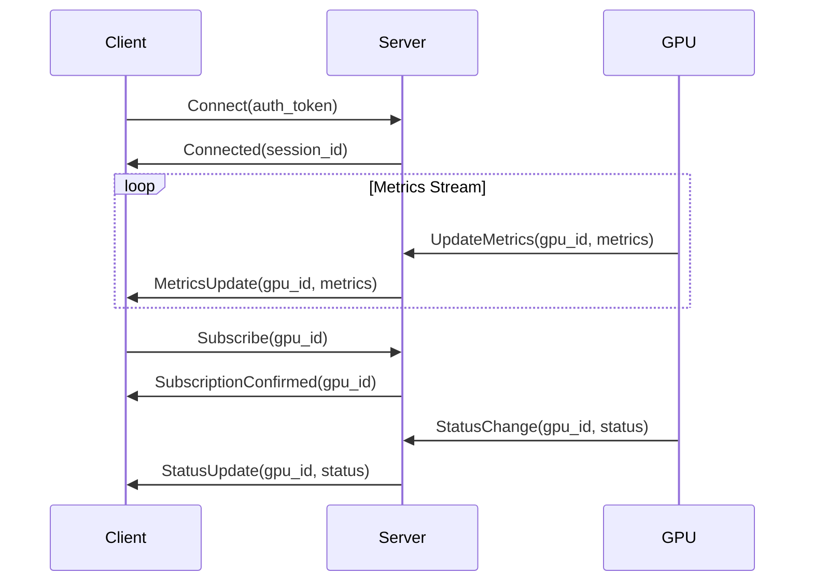

### 5.3.3 Integration Interfaces

| Service | Integration Method | Authentication |
|---------|-------------------|----------------|
| Google OAuth | OAuth 2.0 | JWT tokens |
| Stripe | REST API | API keys |
| GPU Metrics | gRPC streams | mTLS |
| Storage | S3 API | Access keys |

### 5.3.4 API Security

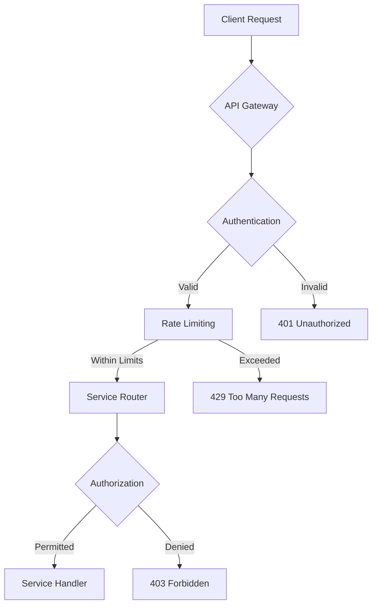

# 6. USER INTERFACE DESIGN

## 6.1 Common Elements

### Icon/Symbol Key
```
[?] - Help/Documentation
[$] - Payment/Billing 
[i] - Information
[+] - Add/Create New
[x] - Close/Delete
[<] [>] - Navigation
[^] - Upload
[#] - Dashboard Menu
[@] - User Profile
[!] - Alert/Warning
[=] - Settings
[*] - Favorite/Important
[ ] - Checkbox
( ) - Radio Button
[v] - Dropdown Menu
[...] - Text Input Field
[====] - Progress Bar
```

## 6.2 Landing Page

```
+----------------------------------------------------------+
|                    Provocative Cloud                    [=]|
+----------------------------------------------------------+
|                                                           |
|     +------------------------------------------------+   |
|     |           High-Performance GPU Rental           |   |
|     |        with Carbon Capture Technology           |   |
|     |                                                |   |
|     |  [Sign in with Google]    [Learn More] [?]     |   |
|     +------------------------------------------------+   |
|                                                           |
|  Available GPUs:                                          |
|  +------------------+ +------------------+                |
|  | NVIDIA A100      | | NVIDIA V100      |                |
|  | 80GB VRAM       | | 32GB VRAM        |                |
|  | $4.50/hour      | | $2.75/hour       |                |
|  +------------------+ +------------------+                |
|                                                           |
|  [View All GPUs >]                                       |
+----------------------------------------------------------+
```

## 6.3 User Dashboard

```
+----------------------------------------------------------+
| Provocative Cloud                              [@User] [=] |
+----------------------------------------------------------+
| [#] Dashboard                                             |
| +-- Active Rentals                                        |
| +-- Billing History                                       |
| +-- SSH Keys                                              |
+----------------------------------------------------------+
|                                                           |
|  Active GPU Rentals:                                      |
|  +------------------------------------------------+      |
|  | Server: gpu-01.provocative.cloud               [x]|    |
|  | GPU: NVIDIA A100 - 80GB                           |    |
|  | Status: [============================] Running     |    |
|  | Uptime: 14h 23m                                   |    |
|  | Cost: $63.25                                      |    |
|  | [SSH Connect] [Jupyter] [Monitor] [$Billing]      |    |
|  +------------------------------------------------+      |
|                                                           |
|  [+ New Rental]                                          |
|                                                          |
|  System Metrics:                                         |
|  +------------------------------------------------+     |
|  | Temperature: 65°C [===========]                  |     |
|  | GPU Usage: 92% [===============]                 |     |
|  | Memory: 65GB/80GB [==========]                  |     |
|  +------------------------------------------------+     |
+----------------------------------------------------------+
```

## 6.4 Host Dashboard

```
+----------------------------------------------------------+
| Provocative Cloud                         [@Admin Host][=] |
+----------------------------------------------------------+
| [#] Host Controls                                         |
| +-- Servers                                               |
| +-- Pricing                                               |
| +-- Analytics                                             |
+----------------------------------------------------------+
|                                                           |
|  Server Management:                                       |
|  +------------------------------------------------+      |
|  | gpu-01.provocative.cloud                     [!]|      |
|  | Status: Online                                  |      |
|  | GPUs: 4x NVIDIA A100                           |      |
|  | Utilization: 92% [===============]             |      |
|  | Revenue: $245.75 (24h)                         |      |
|  | [Maintenance Mode] [Configure] [Metrics]        |      |
|  +------------------------------------------------+      |
|                                                           |
|  [+ Add Server]                                          |
|                                                          |
|  Pricing Configuration:                                  |
|  +------------------------------------------------+     |
|  | GPU Model    | Base Price | Current | Adjust    |     |
|  | NVIDIA A100  | $4.50/hr   | $4.50   | [v]      |     |
|  | NVIDIA V100  | $2.75/hr   | $2.75   | [v]      |     |
|  +------------------------------------------------+     |
+----------------------------------------------------------+
```

## 6.5 GPU Rental Flow

```
+----------------------------------------------------------+
| Select GPU                                                |
+----------------------------------------------------------+
|  +------------------------------------------------+      |
|  | ( ) NVIDIA A100 - 80GB                         |      |
|  |     $4.50/hour                                 |      |
|  |     Available: 3 units                         |      |
|  |                                                |      |
|  | ( ) NVIDIA V100 - 32GB                        |      |
|  |     $2.75/hour                                |      |
|  |     Available: 5 units                        |      |
|  +------------------------------------------------+      |
|                                                           |
|  Duration: [...] hours  [v]                              |
|  Auto-renew: [ ]                                         |
|                                                          |
|  Deployment Options:                                     |
|  ( ) SSH Access                                          |
|  ( ) Jupyter Notebook                                    |
|  ( ) Docker Container                                    |
|                                                          |
|  [< Back] [Calculate Price] [Rent GPU >]                 |
+----------------------------------------------------------+
```

## 6.6 Jupyter Interface

```
+----------------------------------------------------------+
| Jupyter Notebook - gpu-01.provocative.cloud           [=] |
+----------------------------------------------------------+
| [#] File  Edit  View  Insert  Cell  Kernel  Help          |
+----------------------------------------------------------+
|  +----------------+ +--------------------------------+     |
|  | Files          | | Untitled.ipynb                |     |
|  | [^] Upload     | | In [1]:                       |     |
|  | [+] New        | | import torch                  |     |
|  |                | | device = torch.cuda.current_  |     |
|  | > Notebooks    | |                               |     |
|  | > Data         | |                               |     |
|  | > Checkpoints  | |                               |     |
|  +----------------+ +--------------------------------+     |
|                                                           |
|  GPU Status:                                             |
|  Memory: 45GB/80GB [=======]                             |
|  Utilization: 78% [============]                         |
|                                                          |
|  [Run] [Stop] [Restart Kernel]                           |
+----------------------------------------------------------+
```

## 6.7 Mobile Responsive Design

```
+--------------------+
| Provocative Cloud  |
| [@User]    [=]     |
+--------------------+
| Active Rentals (2) |
+--------------------+
| gpu-01.prov.cloud  |
| NVIDIA A100        |
| Running [====]     |
| $63.25            |
| [Actions v]        |
+--------------------+
| gpu-02.prov.cloud  |
| NVIDIA V100        |
| Running [====]     |
| $27.50            |
| [Actions v]        |
+--------------------+
| [+ New Rental]     |
+--------------------+
| Metrics [>]        |
| Billing [$]        |
| Support [?]        |
+--------------------+
```

## 6.8 Responsive Breakpoints

| Breakpoint | Width | Layout Changes |
|------------|-------|----------------|
| Mobile | 320px-767px | Single column, stacked components |
| Tablet | 768px-1023px | Two column, condensed metrics |
| Desktop | 1024px-1439px | Full layout, expanded metrics |
| Large | 1440px+ | Full layout with additional data |

## 6.9 Theme Specifications

| Element | Light Theme | Dark Theme |
|---------|-------------|------------|
| Background | #FFFFFF | #1A1A1A |
| Primary Text | #333333 | #FFFFFF |
| Secondary Text | #666666 | #CCCCCC |
| Accent | #0066CC | #3399FF |
| Alert | #FF3300 | #FF6666 |
| Success | #33CC33 | #66FF66 |
| Border | #CCCCCC | #333333 |

# 7. SECURITY CONSIDERATIONS

## 7.1 AUTHENTICATION AND AUTHORIZATION

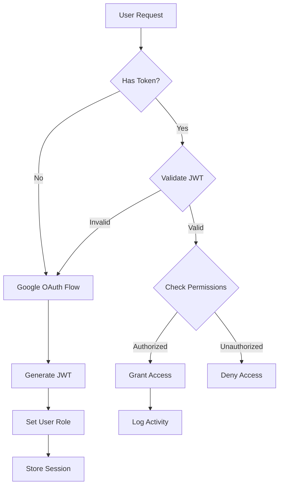

| Authentication Method | Implementation Details |
|----------------------|------------------------|
| Primary Authentication | Google OAuth 2.0 with OpenID Connect |
| Session Management | JWT tokens with 24-hour expiration |
| MFA Support | Google Authenticator integration |
| API Authentication | Bearer token authentication |
| SSH Access | ED25519 key pairs with passphrase requirement |

### Role-Based Access Control (RBAC)

| Role | Permissions |
|------|------------|
| User | - View available GPUs<br>- Create/manage reservations<br>- Access rented resources<br>- View billing history |
| Host | - Manage GPU servers<br>- Configure pricing<br>- View analytics<br>- Access maintenance controls |
| Admin | - Full system access<br>- User management<br>- Security configuration<br>- Audit log access |

## 7.2 DATA SECURITY

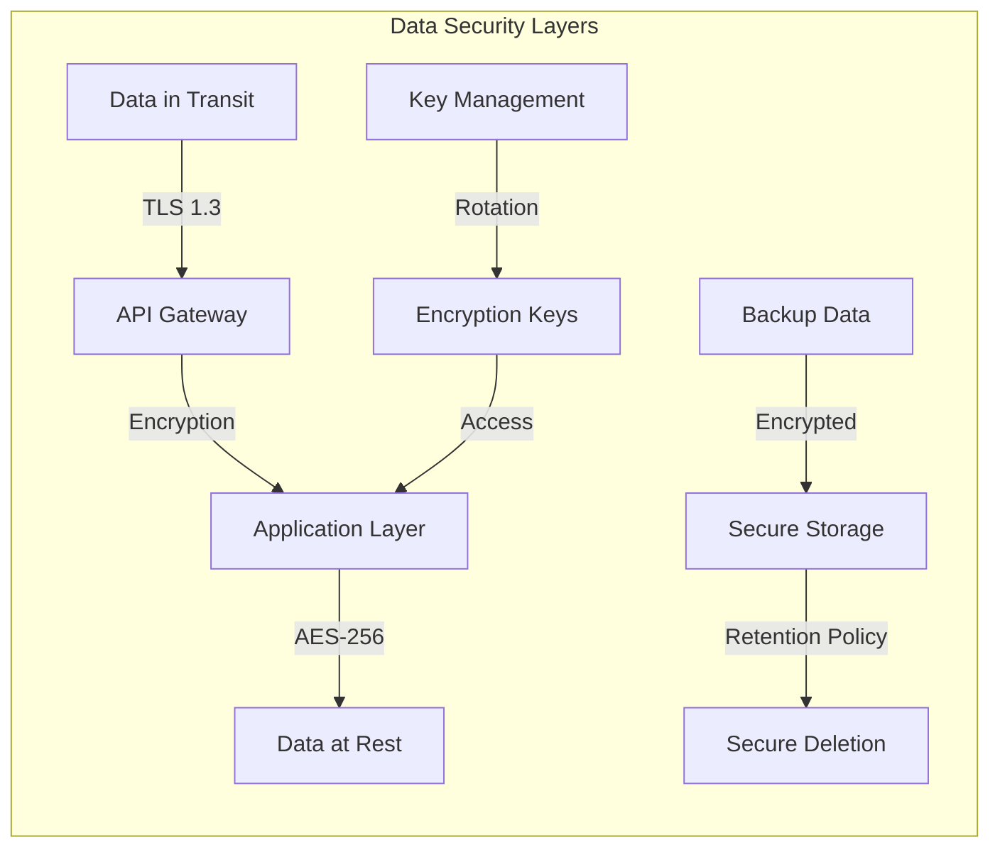

| Security Measure | Implementation |
|-----------------|----------------|
| Data at Rest | AES-256 encryption for all stored data |
| Data in Transit | TLS 1.3 with strong cipher suites |
| Key Management | AWS KMS for key storage and rotation |
| Backup Security | Encrypted backups with secure offsite storage |
| PII Protection | Data masking and tokenization |

### Data Classification

| Data Type | Security Level | Protection Measures |
|-----------|---------------|-------------------|
| User Credentials | Critical | Hashed with Argon2id, salted |
| Payment Information | Critical | Tokenized via Stripe |
| GPU Metrics | Internal | Encrypted at rest |
| System Logs | Internal | Encrypted, access controlled |
| Public Data | Public | Integrity protected |

## 7.3 SECURITY PROTOCOLS

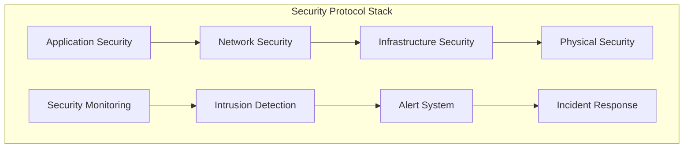

### Network Security

| Protocol | Implementation |
|----------|---------------|
| Firewall | AWS Security Groups with least privilege |
| DDoS Protection | Cloudflare with rate limiting |
| VPN Access | WireGuard for administrative access |
| Network Isolation | VPC segmentation with private subnets |

### Security Monitoring

| Component | Details |
|-----------|---------|
| Log Management | ELK Stack with 90-day retention |
| Intrusion Detection | Fail2ban and AWS GuardDuty |
| Vulnerability Scanning | Weekly automated scans |
| Security Updates | Automated patching system |

### Compliance Controls

| Requirement | Implementation |
|-------------|----------------|
| Access Logging | Detailed audit trails for all actions |
| Incident Response | Documented procedures and team roles |
| Change Management | Version-controlled infrastructure as code |
| Security Training | Required annual security awareness training |

### Security Headers and Configurations

| Header/Setting | Value |
|---------------|-------|
| Content-Security-Policy | strict-dynamic with nonces |
| X-Frame-Options | DENY |
| X-Content-Type-Options | nosniff |
| Strict-Transport-Security | max-age=31536000; includeSubDomains |
| Cookie Security | Secure; HttpOnly; SameSite=Strict |

### SSH Security Configuration

| Setting | Value |
|---------|-------|
| Protocol Version | SSH-2 only |
| Key Exchange | curve25519-sha256 |
| Ciphers | chacha20-poly1305@openssh.com, aes256-gcm@openssh.com |
| MACs | hmac-sha2-512-etm@openssh.com |
| Authentication | Public key only, password authentication disabled |
| Root Login | Disabled |

# 8. INFRASTRUCTURE

## 8.1 DEPLOYMENT ENVIRONMENT

```mermaid
flowchart TD
    subgraph "Deployment Architecture"
        A[Primary Data Center] -->|High-Speed Link| B[Cloud Services]
        A -->|Backup Link| C[Disaster Recovery]
        
        subgraph "Primary Data Center"
            D[GPU Servers]
            E[Storage Systems]
            F[Network Infrastructure]
            G[Carbon Capture System]
        end
        
        subgraph "Cloud Services"
            H[AWS Services]
            I[CDN]
            J[DNS]
        end
        
        subgraph "Disaster Recovery"
            K[Backup Data Center]
            L[Replicated Storage]
        end
    end
```

| Environment Type | Components | Purpose |
|-----------------|------------|----------|
| Primary Data Center | - GPU Server Racks<br>- Storage Arrays<br>- Network Equipment<br>- Carbon Capture System | Main processing and hosting environment |
| Cloud Integration | - AWS Services<br>- CDN<br>- DNS<br>- Object Storage | Supporting services and global distribution |
| Disaster Recovery | - Backup Data Center<br>- Replicated Storage<br>- Standby Systems | Business continuity and failover |

## 8.2 CLOUD SERVICES

| Service | Provider | Purpose | Justification |
|---------|----------|---------|---------------|
| DNS & CDN | Cloudflare | Global content delivery and DDoS protection | - Global presence<br>- DDoS mitigation<br>- SSL termination |
| Object Storage | AWS S3 | User data and system backups | - Durability<br>- Global replication<br>- Cost-effective |
| Load Balancing | AWS ALB | Traffic distribution | - High availability<br>- SSL termination<br>- Health checks |
| Monitoring | AWS CloudWatch | System metrics and logging | - Centralized monitoring<br>- Custom metrics<br>- Alert integration |
| Authentication | Google Cloud | OAuth provider | - Reliable service<br>- Wide adoption<br>- Strong security |

## 8.3 CONTAINERIZATION

```mermaid
flowchart LR
    subgraph "Container Architecture"
        A[User Workload] --> B{Container Type}
        B -->|Custom| C[Docker Container]
        B -->|Managed| D[Jupyter Container]
        
        C --> E[Container Runtime]
        D --> E
        
        E --> F[GPU Access]
        E --> G[Storage Volume]
        E --> H[Network]
    end
```

| Component | Implementation | Purpose |
|-----------|---------------|----------|
| Container Runtime | Docker Engine 24.0+ | Primary container platform |
| GPU Support | NVIDIA Container Toolkit | GPU access in containers |
| Base Images | Ubuntu 20.04 | Standardized environment |
| Volume Management | Docker Volumes | Persistent storage |
| Network | Docker Network | Container networking |

## 8.4 ORCHESTRATION

```mermaid
flowchart TD
    subgraph "Kubernetes Architecture"
        A[API Gateway] --> B[Ingress Controller]
        B --> C{Service Mesh}
        
        C --> D[User Workloads]
        C --> E[System Services]
        
        D --> F[GPU Nodes]
        E --> G[Management Nodes]
        
        H[Monitoring] --> D
        H --> E
    end
```

| Component | Implementation | Purpose |
|-----------|---------------|----------|
| Orchestrator | Kubernetes 1.27+ | Container orchestration |
| Service Mesh | Istio | Service communication |
| Ingress | NGINX Ingress | External access |
| GPU Operator | NVIDIA GPU Operator | GPU management |
| Storage Class | Rook-Ceph | Persistent storage |

## 8.5 CI/CD PIPELINE

```mermaid
flowchart LR
    subgraph "CI/CD Pipeline"
        A[Git Push] --> B[GitHub Actions]
        B --> C{Tests}
        C -->|Pass| D[Build]
        C -->|Fail| E[Notify]
        
        D --> F{Environment}
        F -->|Dev| G[Development]
        F -->|Staging| H[Staging]
        F -->|Prod| I[Production]
        
        G --> J[Validation]
        H --> J
        J -->|Pass| K[Deploy]
        J -->|Fail| E
    end
```

| Stage | Tools | Purpose |
|-------|-------|----------|
| Source Control | GitHub | Code repository |
| CI/CD Platform | GitHub Actions | Pipeline automation |
| Testing | Jest, PyTest | Automated testing |
| Security Scan | SonarQube, Snyk | Code security |
| Registry | AWS ECR | Container registry |
| Deployment | ArgoCD | GitOps deployment |
| Monitoring | Prometheus/Grafana | Pipeline monitoring |

### Deployment Environments

| Environment | Purpose | Update Frequency |
|-------------|---------|------------------|
| Development | Feature testing | On commit |
| Staging | Integration testing | On PR merge |
| Production | Live environment | On release tag |

### Deployment Process

1. Code Push Triggers:
   - Feature branch: Dev deployment
   - Main branch: Staging deployment
   - Release tag: Production deployment

2. Automated Steps:
   - Code validation
   - Unit tests
   - Security scans
   - Container builds
   - Integration tests
   - Environment deployment

3. Validation Gates:
   - Test coverage > 80%
   - Zero security vulnerabilities
   - Performance benchmarks
   - Integration test success

# APPENDICES

## A.1 ADDITIONAL TECHNICAL INFORMATION

### A.1.1 Carbon Capture Integration

```mermaid
flowchart TD
    A[GPU Server Heat] --> B[Cooling System]
    B --> C[Airflow Management]
    C --> D[CO2 Extraction]
    D --> E[Carbon Storage]
    
    B --> F[Temperature Metrics]
    C --> G[Airflow Metrics]
    D --> H[CO2 Capture Metrics]
    
    F --> I[Monitoring System]
    G --> I
    H --> I
    
    I --> J[Environmental Reports]
    I --> K[Efficiency Analytics]
```

### A.1.2 Resource Allocation Matrix

| Resource Type | Allocation Strategy | Monitoring Metrics |
|--------------|---------------------|-------------------|
| GPU Memory | Dynamic allocation based on workload | VRAM usage, memory errors |
| Storage | Quota-based with overflow protection | IOPS, throughput, latency |
| Network | QoS with bandwidth guarantees | Bandwidth usage, packet loss |
| Power | Dynamic power management | Power consumption, efficiency |

### A.1.3 Environmental Impact Tracking

| Metric | Measurement | Reporting Frequency |
|--------|-------------|-------------------|
| CO2 Captured | Tons per month | Monthly |
| Power Usage Effectiveness | PUE ratio | Daily |
| Carbon Usage Effectiveness | CUE ratio | Weekly |
| Water Usage Effectiveness | WUE ratio | Monthly |

## A.2 GLOSSARY

| Term | Definition |
|------|------------|
| Airflow Management | System controlling air movement through server racks for optimal cooling |
| Auto-renew | Automatic extension of GPU rental period based on user preferences |
| Carbon Usage Effectiveness | Metric measuring total carbon emissions relative to IT equipment energy usage |
| CUDA | NVIDIA's parallel computing platform and programming model |
| Docker Container | Standardized unit of software packaging code and dependencies |
| GPU-hour | Unit of measurement for GPU rental duration |
| Host Dashboard | Administrative interface for managing GPU resources |
| Idle Detection | System for identifying inactive GPU resources |
| Jupyter Notebook | Web application for creating and sharing documents containing live code |
| Power Usage Effectiveness | Ratio of total facility energy to IT equipment energy |
| Provisioning | Process of setting up and configuring GPU servers for user access |
| QoS | Quality of Service controls for network resource management |
| User Dashboard | Interface for managing GPU rentals and monitoring usage |
| VRAM | Video RAM, specialized memory on GPUs |
| Water Usage Effectiveness | Metric measuring water usage for cooling relative to IT equipment energy |

## A.3 ACRONYMS

| Acronym | Full Form |
|---------|-----------|
| API | Application Programming Interface |
| AWS | Amazon Web Services |
| CCPA | California Consumer Privacy Act |
| CDN | Content Delivery Network |
| CLI | Command Line Interface |
| CO2 | Carbon Dioxide |
| CORS | Cross-Origin Resource Sharing |
| CPU | Central Processing Unit |
| CRUD | Create, Read, Update, Delete |
| CSP | Cloud Service Provider |
| CUE | Carbon Usage Effectiveness |
| DDoS | Distributed Denial of Service |
| DNS | Domain Name System |
| ELK | Elasticsearch, Logstash, Kibana |
| GDPR | General Data Protection Regulation |
| GPU | Graphics Processing Unit |
| gRPC | Google Remote Procedure Call |
| HA | High Availability |
| HTTP | Hypertext Transfer Protocol |
| HTTPS | Hypertext Transfer Protocol Secure |
| IOPS | Input/Output Operations Per Second |
| JWT | JSON Web Token |
| KVM | Kernel-based Virtual Machine |
| MFA | Multi-Factor Authentication |
| MQTT | Message Queuing Telemetry Transport |
| NVMe | Non-Volatile Memory Express |
| OAuth | Open Authorization |
| PCI DSS | Payment Card Industry Data Security Standard |
| PUE | Power Usage Effectiveness |
| RAID | Redundant Array of Independent Disks |
| RBAC | Role-Based Access Control |
| REST | Representational State Transfer |
| SLA | Service Level Agreement |
| SOC | Service Organization Control |
| SSH | Secure Shell |
| SSL | Secure Sockets Layer |
| TLS | Transport Layer Security |
| UI | User Interface |
| VM | Virtual Machine |
| VPC | Virtual Private Cloud |
| WUE | Water Usage Effectiveness |